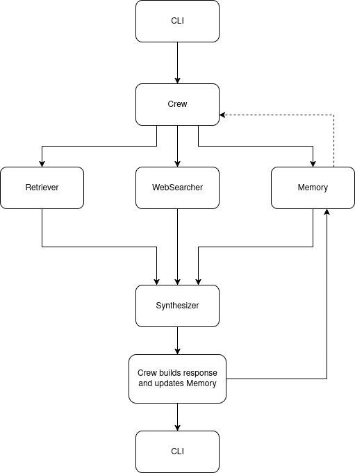

# 🧪 **Neuroscience Foundation Q&A Crew**

## **Overview**
This is a multi-agent system capable of answering questions about **dopamine** by performing:

* **RAG** (Retrieval-Augmented Generation) using 10 PDF documents
* **Live web search** to fill in gaps or verify claims
* **Source-aware generation**: Each answer should clearly state where the information came from (e.g., “Paper X, page 5”, or “NIH.gov”)
* **Conversational memory**: Maintain useful dialogue context across a session

## **Architecture**

### **Architecture Diagram**



As can be seen, the system consists of a multi-agent architecture. There are several reasons for this approach:

1. **Flexibility and Maintainability**

	Each agent performs one task well:

- Retriever for data retrieval.
- WebSearcher for web search.
- Synthesizer for answer generation.
- MemoryKeeper for memory storage.

	This results in a system which is easy to test, extendable and capable of swapping parts if needed:

	Want a new embedding model? Just swap the Retriever.
	Want to upgrade from OpenAI to local LLM? Swap the Synthesizer.

2. **RAG Pipeline**

	Retrieval-Augmented Generation is the best practice for answering questions from a fixed knowledge base (here we also add web retrieval).

	By using this approach we:
	
	- Ensure answers are grounded in actual sources (quite important when it comes to answering questions about science).
	- Enable real-time updates (via web search) without having to re-train a model.
	- Source-awareness: You can control the sources from which the answer comes.

3. **Source citation**

	It was demanded to clearly state where the information came from.
	The architecture implemented traces answers to either a specific paper and page or a URL. By leveraging the Retriever module capabilities, we can add significant value (and trust) to the responses the system outputs.

4. **Conversational Memory**

	The system supports follow up questions and meta-questions (e.g., "What was the first question?"). A dedicated MemoryKeeper module aids the assistant in tracking the whole dialog. This proves of real importance when considering putting a system of this kind into production.

5. **Uncertainty and Multi-source Reasoning**

	The system is capable of providing answers from multiple (possibly conflicting) sources.

6. **Clean separation of concerns**

	Each component can be developed and tested independently. Some components can be mocked (e.g. WebSearcher) and can be deployed at different scales (vectorDB can be remote).

7. **Ease of deployment**

	By adding capabilities like user authentication, session IDs, API endpoints, a web frontend or even multi-user memory, the system can be deployed with little change.
	Want to add new research papers? Just drop the PDFs in the papers folder.

## **Component Description**

1. **PDF Retriever**

	**Purpose**
	- Loads, splits and indexes PDFs from the papers folder.

	**How it works**
	1. **PDF Loading**
		- Loads all PDF files from the papers folder using a PDF Loader.
		- Each document is split into smaller chunks for efficient search and context window fitting.

	2. **Embedding and indexing**
		- Uses a text embedding model (all-MiniLM-L6-v2 from HuggingFace) to convert text chunks into numerical vectors.
		- Stores these vectors in a Chroma vector database (persisted on a folder named chroma_db for fast future retrieval).

	3. **Retrieval**
		- When a question comes in, it's embedded the same way.
		- The most semantically similar document chunks are retrieved and returned (with source metadata for citation).

	**How it connects**
	- Used by Crew (orchestrator) to fetch relevant content for the Synthesizer (LLM).

2. **WebSearcher**

	**Purpose**
	- Performs live web search to supplement answers with fresh, trusted online information.

	**How it works**

	1. **Search API**
		- Uses a web search API (SerpAPI) to issue queries to Google.

	2. **Result Processing**
		- Extracts relevant title, snippet and URL from top results.
		- Structures results as "chunks" with citation metadata.

	**How it connects**
	- Crew asks WebSearcher for web chunks in parallel to PDF retrieval.
	- These results are mixed with PDF chunks for answer synthesis.

3. **MemoryKeeper**

	**Purpose**
	- Tracks conversation history for contextual continuity and meta-questions (e.g., "What was the first question?").

	**How it works**
	- Stores every Q&A (and sources) in a chronological list.
	- Supports queries for last N turns, the Nth question or summary of past interactions.

	**How it connects**
	- Crew adds every question/answer to Memory after handling a turn.
	- Used to answer meta-questions and provide conversational context to the Synthesizer.

4. **Synthesizer**

	**Purpose**
	- Synthesizes a natural language answer using retrieved PDF and web chunks in addition to conversational history as context.

	**How it works**
	1. **Prompt construction**
		- Formats retrieved document and web chunks adding explicit citation markers (e.g., [1], [W1]).
		- Crafts a prompt for the LLM which instructs it to answer with citations.

	2. **LLM Completion**
		- Calls a language model with the question and formatted context.
		- Extracts the answer and parses which citations were referenced.

	3. **Structured output**
		- Returns answer, list of cited sources and "Synthesized by LLM based on provided document and web chunks."

	**How it connects**
	- Crew calls Synthesizer after gathering all relevant context (from MemoryKeeper, Retriever and WebSearcher).
	- Synthesizer is the final answer generator.

5. **Crew (orchestrator)**

	**Purpose**
	- Main orchestrator: coordinates all agent modules to answer user questions.

	**How it works**
	1. **Meta-question handling**
		- Detects and directly answers "meta-questions" about the conversation (e.g., "What was the first question?") from memory bypassing the LLM.

	2. **Normal Q&A pipeline**
		- Retrieves top-matching PDF and web chunks for the question.
		- Passes them to the Synthesizer (together with conversational history) for answer generation.
		- Records every turn in Memory.

	3. **Structured response**
		- Returns the answer, sources and conversational memory for interface display.

	**How it connects**
	- Entry point for the CLI. 
	- Calls and combines all other agent modules.

	**High-level pseudocode**
	For each question:
		- Check for meta-question (history query)
		- Otherwise, gather relevant context (retriever, web, memory)
		- Synthesize answer with citations
		- Store Q&A in memory
		- Return structured answer


6. **CLI**

	**Purpose**
	- Provides a simple user interface for interacting with the Crew.

	**How it works**
	- Prompts the user for questions.
	- Sends the question to Crew's handle_question.
	- Displays the answer and sources in a readable format.
	- Maintains a conversation loop for follow-ups.

## **Setup/How to run**

1. **Create a Python Virtual Environment**
	```sh
    python -m venv env
    ```
2. **Activate the virtual environment**
	```sh
    source env/bin/activate
    ```
3. **Install dependencies from requirements.txt file'**
	```sh
    pip install -r requirements.txt
    ```
4. **Edit .env.sample and rename it .env**
	- This file will contain the necessary API keys for the system to work.

5. **Run CLI**
	```sh
    python -m interface.cli
    ```
6. **Ask away😊**
	- Whenever you feel like exiting the system, just type 'exit' and it will shut down.

## **Sample input and output**
```
    Ask a question about dopamine: What is dopamine's function in the brain?

	Thinking...
	INFO:httpx:HTTP Request: POST https://api.openai.com/v1/chat/completions "HTTP/1.1 200 OK"
	INFO:MemoryKeeper:Added memory entry. Total entries: 1

	Answer:
	Dopamine is a neurotransmitter produced in various brain regions such as the substantia nigra, ventral tegmental area, and hypothalamus [1,2]. Its primary function in the brain includes regulating movement, controlling body movements, and playing a crucial role in the reward system [4]. Dopamine is involved in inhibiting the production of prolactin, influencing behavior, motivation, and regulating the reward pathway [4]. Additionally, dopamine is essential for various physiological functions, including memory and movement [W1].

	In summary, dopamine's function in the brain involves regulating movement, controlling body movements, influencing behavior and motivation, and playing a crucial role in the brain's reward system.

	Sources:
	PDF: Dopamine_in_Parkinsons_disease.pdf (page 2)
	----------------------------------------
	Web: Dopamine: What It Is, Function & Symptoms (https://my.clevelandclinic.org/health/articles/22581-dopamine)
	----------------------------------------
	Ask a question about dopamine: Can you summarize differences in dopamine function between ADHD and Parkinson's disease?

	Thinking...
	INFO:httpx:HTTP Request: POST https://api.openai.com/v1/chat/completions "HTTP/1.1 200 OK"
	INFO:MemoryKeeper:Added memory entry. Total entries: 2

	Answer:
	Dopamine function differs between ADHD and Parkinson's disease. In ADHD, dysfunction of the dopaminergic system is implicated in the pathophysiology of the disorder, affecting motor control, cognition, emotion, and reward processes [3,4]. The DA hypothesis in ADHD suggests abnormalities in motor, motivational, and reward processes, which are targeted by drugs that modulate dopamine receptor sites [4]. Additionally, individuals with ADHD often have elevated levels of dopamine [W1].

	On the other hand, in Parkinson's disease, individuals generally have reduced levels of dopamine transporters [W1]. Parkinson's disease is characterized by damage to brain regions involved in controlling movement and a decrease in dopamine production [W2]. However, a study evaluating causality between ADHD and Parkinson's disease did not support a direct causal link between the two conditions [W3].

	In summary, while ADHD is associated with elevated dopamine levels and dysfunction in dopamine-mediated processes, Parkinson's disease is characterized by reduced dopamine levels and damage to brain regions involved in movement control.

	Sources:
	PDF: Role_of_Dopamine_Receptors_in_ADHD_A_Systematic_Me.pdf (page 2)
	----------------------------------------
	Web: ADHD and Parkinson's Disease: Are They Related? (https://www.healthline.com/health/adhd/adhd-and-parkinsons)
	----------------------------------------
	Web: ADHD and Parkinson's: Is there a link? (https://www.medicalnewstoday.com/articles/adhd-and-parkinsons)
	----------------------------------------
	Web: Evaluation of causality between ADHD and Parkinson's ... (https://www.sciencedirect.com/science/article/abs/pii/S0924977X20301863)
	----------------------------------------
	Ask a question about dopamine: Which condition involves lower dopamine levels?

	Thinking...
	INFO:httpx:HTTP Request: POST https://api.openai.com/v1/chat/completions "HTTP/1.1 200 OK"
	INFO:MemoryKeeper:Added memory entry. Total entries: 3

	Answer:
	Parkinson's disease involves lower dopamine levels compared to ADHD. Individuals with Parkinson's disease generally have reduced levels of dopamine transporters [W1]. This reduction in dopamine levels is due to the loss of dopaminergic neurons in Parkinson's disease, leading to motor impairment and other symptoms associated with the condition [W3].

	Sources:
	Web: Dopamine Deficiency: Symptoms, Causes & Treatment (https://my.clevelandclinic.org/health/articles/22588-dopamine-deficiency)
	----------------------------------------
	Web: Depletion of dopamine in Parkinson's disease and relevant ... (https://pmc.ncbi.nlm.nih.gov/articles/PMC10567584/)
	----------------------------------------
	Ask a question about dopamine: What was the first question?

	Thinking...

	Answer:
	What is dopamine's function in the brain?

	Sources:
	Ask a question about dopamine: exit
	Goodbye!
```
## Known Limitations

- The system instructs the language model (LLM) to only cite sources (e.g., [1], [W2]) that are part of the current context for each question. However, due to LLM limitations, it may sometimes hallucinate references to citations (like [3], [W3]) that do not correspond to any of the sources listed below the answer.
- The numbers inside brackets ([1], [2], [W1], etc.) **refer to the order in which sources were provided to the model for that specific answer**. The same file or website may have a different number in a different answer, depending on what was retrieved for that turn. There is **no persistent mapping** across questions.
- Always cross-check the “Sources” section listed after each answer to verify which files or URLs were actually retrieved for that question.
- **For critical or scientific use cases, always manually review cited content. This system is a research prototype and not a replacement for human review.**

## **Extending the system**
- **Adding more papers:** Drop additional PDF files into the papers directory and rerun the indexer.
- **Swapping the LLM:** If you wish to use a local LLM, modify the Synthesizer class.
- **Alternative embedding models:** You can change the model name in the PDFRetriever class to use any HuggingFace embedding model.
- **Deploy as a web service:** Adapt the core logic into a FastAPI (or other web framework) app to serve multiple users via REST or a web frontend.
- **Multi-user or session support:** Extend the MemoryKeeper module to manage dialogue state for multiple concurrent users or add authentication.
- **Containerized deployment (Docker Compose):** For scalable or production deployments, the system can be run using Docker Compose with the Q&A app and the Chroma vector database running in separate containers. 
This approach makes it easier to persist vector data, scale services independently and simplifies setup for other developers or cloud environments. 

### **Production considerations**
- Persist Chroma DB storage on a mounted volume and backup data regularly.
- Since the app and Chroma DB storage will run on separate containers, the app could be scaled horizontally to serve more users. 
- Memory usage grows with the number of indexed documents and concurrent users. Chroma and embedding models require more RAM as PDF set grows.
- Major cost drivers: LLM API usage, storage for Chroma, outbound web search API calls. These can be optimized by caching results and minimizing LLM calls.
- Monitoring and logging: Logging and error tracking can be used to check for high error rates or slow queries.


